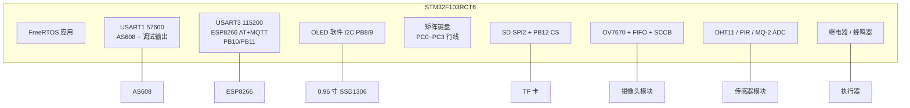

# 单芯片 STM32F103RCT6 — 硬件连接方案

**版本说明**：本文档描述 **单颗 STM32F103RCT6（LQFP64）** 智能安防工程的接线、电源与共地要求。固件 **`EN_OV7670_LOCAL` 默认 1**（本地摄像头开）。  
**固件路径**：`biye\代码\`（Keil：`User\程序.uvprojx`）。  
**权威对照**：`代码\User\board_config.h`（工程**始终保留 SWD**，**PA13/PA14** 专用于下载调试，不作 GPIO）；分步调试见 **`硬件/单芯片STM32F103RCT6智能安防系统_硬件调试Checklist.md`**。  
**文档修订（硬件要点）**：① **ESP8266**：**USART3** **PB10/PB11**，**EN=PC9**（勿用 PA2/3/4，避免与 OV 并口冲突）。② **矩阵键盘第 4 行 X4**：**PC3**（**勿**接到 **PC10**，该脚为蜂鸣器 **`BEEP`**；**勿**误接 **PC13**，不少核心板该脚为 LED）。③ **蜂鸣器**：**PC10**，**低电平触发**时保持 **`BOARD_BEEP_ACTIVE_HIGH`** 为 **0**（默认）；**`gpio.h`**：`BEEP_SoundOn`/`BEEP_SoundOff`；**`board_config.h`**：`BOARD_BEEP_*`；**`gpio.c`** 初始化。仅当模块为 **高电平触发** 时才将该宏改为 **1**。  
**摄像头 + WiFi 同时工作**：ESP8266 **不得**再接 **PA2/PA3/PA4**（它们属于 **OV7670 并口 D2~D4**，与 **PA0~PA7** 同束连续接线）。固件将 WiFi 串口放在 **USART3（PB10/PB11）**，**EN/CH_PD** 在 **PC9**（与其它外设无复用）。  
**核心板**：若使用第三方最小系统板，以 **丝印 ↔ MCU 引脚** 对照为准；RCT6 为64 脚，与 48 脚 C8 核心板的排针引出范围可能不同。

---

## 1. 系统总体框图

**数据流概要**

| 类型 | 内容 |
|------|------|
| 本地采集 | PIR、DHT11、MQ-2（PB0 ADC）、指纹、键盘 |
| 图像 | OV7670+FIFO 经并口读入；抓拍 BMP 写入 **SD（SPI2）** |
| 联网 | ESP8266（**USART3** PB10/PB11）WiFi、OneNET 物模型（以 `esp8266_onenet_mqtt` / `esp8266_tls` 实际编译配置为准） |
| 人机 | OLED（PB8/PB9）、蜂鸣器（**PC10**/`BEEP`）、继电器联动 |

---

## 2. 杜邦线分束接线（同一模块集中在一束）

**目的**：每个外设单独做一束杜邦线，线序在表里从上到下即 **MCU 侧排针 → 模块插座**，扎带固定后整束插拔，减少交叉、错脚。

**通用规则**

- 每一束至少含 **GND**；需供电的模块再加 **3V3**（或按模块要求 5V），与主板 **共地**。
- 板子丝印常见写法：**A0＝PA0、B8＝PB8、C4＝PC4、D2＝PD2**（以你核心板手册为准）。
- **PA13 / PA14** 仅 SWD，**不要**编入任何外设线束。
- 若核心板 **PC6 / PC7** 等已被板载按键、LED 占用，与 `board_config.h` 中继电器定义冲突时，须 **改固件引脚或换引出方式**，勿强行并线。

### 2.1 束线总览（接杜邦前先看这一表）

| 线束编号 | 模块 | MCU 引脚（整束一起接） | 电源地 |
|----------|------|----------------------|--------|
| ① | AS608 指纹 | PA9 TX → 模块 RX；PA10 RX → 模块 TX；PA8 PS_Sta | 3V3、GND |
| ② | ESP8266 | **PB10** TX → 模块 RX；**PB11** RX ← 模块 TX；**PC9** EN/CH_PD | 3V3、GND（大电流单独供电更佳） |
| ③ | 串口监听（可选） | **USART1** PA9/10，与 AS608 / `printf` 共用 **57600**；**勿**将 USB-TTL 接到 **PA0~PA7**（摄像头数据总线） | GND |
| ④ | OLED（SSD1306，软件 I2C） | PB8 SCL；PB9 SDA | 3V3、GND |
| ⑤ | 4×4 矩阵键盘 | 行：PC0、PC1、PC2、**PC3（X4）**；列 **Y1/Y2**：**PC11、PC12**；**Y3/Y4**：固件**默认** `EN_OV7670_LOCAL=1` 时为 **PB1、PB2**；仅当改为 **0**（不接摄像头）时用 **PA5、PA6** | 键盘地共 MCU GND |
| ⑥ | TF 卡（SPI2） | PB12 CS；PB13 SCK；PB14 MISO；PB15 MOSI | 3V3、GND |
| ⑦ | OV7670 + FIFO（`board_config.h` 默认 **开启**） | 数据 PA0～PA7；PA11 VSYNC；PA12 RCK；PB3 WRST、PB4 RRST、PB5 WREN、PB6 OE；SCCB：PD2 SCL、PB7 SDA | 按模块供电、GND |
| ⑧ | 传感器 | PC4 PIR；PC5 DHT11；PB0 MQ-2 模拟出 | GND |
| ⑨ | 执行器 | PC6 门锁继电器；PC7 燃气阀继电器；PC8 照明继电器；**蜂鸣器 PC10**（`BOARD_BEEP_*` / `gpio.h` **`BEEP`**，低电平触发以源码为准） | 继电器侧电源与 MCU 隔离按原理图；控制回路 GND 共板 |

**排针上的“同区扎线”建议（ABrobot 类双排针常见丝印）**

- **摄像头 ⑦**：丝印多在 **A0～A7、A11、A12、B3～B7、D2** 一带成排；固件默认开本地摄像头，键盘 **Y3/Y4** 接 **B1、B2**（见 §6 核对清单）。
- **SD ⑥**：**B12、B13、B14、B15** 常相邻，单独一束最顺。
- **OLED ④**：**B8、B9** 常相邻，与 ② ESP8266 的 **B10、B11** 可同侧走线，仍分 **两个模块两束**，避免插错插座。
- **通信 ① 指纹 / ② WiFi**：指纹 **A8、A9、A10** 单独一束；WiFi 在 **B10、B11** 与 **C9（EN）**，与 **⑦ 摄像头 PA0~A7** 线束**分开**，避免误把 ESP 接到并口。
- **传感器 ⑧**：**C4、C5** 与 **B0** 若分在上下排，可用 **同一扎带** 固定线身，杜邦头仍按脚一一对应。
- **键盘 ⑤（常见薄膜模块）**：丝印 **R1~R4** 对应固件行 **X1~X4** → **PC0、PC1、PC2、PC3**；**C1~C4** 对应列 **Y1~Y4** → **PC11、PC12、PB1、PB2**（`EN_OV7670_LOCAL=1`）。**R4 必须接 PC3**，不要接到 **PC10**（蜂鸣器）或误接 **PC13**（常见为板载 LED）。

---

## 3. MCU 完整引脚分配表

**封装**：LQFP64。下表与 **`board_config.h`** 一致。

### 3.1 串口与 ESP8266 控制

| 功能 | 引脚 | 模式 | 连接对象 | 备注 |
|------|------|-----------|----------|------|
| USART1 TX | **PA9** | AF 推挽 | AS608 **RX** | 57600 8N1（`uart1_Init(57600)`） |
| USART1 RX | **PA10** | 浮空输入 | AS608 **TX** | 与指纹共用 USART1 |
| USART3 TX | **PB10** | AF 推挽 | ESP8266 **RX** | 115200 8N1；**`USART2_Init_Config()` 内实际初始化 USART3**（名称历史遗留） |
| USART3 RX | **PB11** | 浮空输入 | ESP8266 **TX** | 3.3V TTL；**`USART3_IRQHandler`** 同源写入 **`Uart2_Buf`**（OneNET/AT）与 **`Uart3_Buf`**（遥控解析） |
| ESP8266 EN/CH_PD | **PC9** | GPIO | 模块 EN | 与 **PA0~PA7 并口无共脚**，可与摄像头同时工作 |
| USART2（PA2/PA3） | — | — | **本工程未作 ESP 使用** | **PA2、PA3** 为 **OV D2、D3**，随 **§3.5** 摄像头并口接线 |
| AS608 PS_Sta | **PA8** | 输入 | 模块状态 | |

### 3.2 OLED（软件 I2C）

| 功能 | 引脚 | 说明 |
|------|------|------|
| SCL | **PB8** | 软件 I2C |
| SDA | **PB9** | 常见 I2C 地址 0x3C/0x3D，以模块为准 |

### 3.3 矩阵键盘（4 行 × 4 列）

行：**推挽输出**；列：**上拉输入，低有效**（与 `key4_4` 驱动一致）。

| 功能 | 引脚 | 备注 |
|------|------|------|
| X1 / X2 | **PC0 / PC1** | |
| X3 / X4 | **PC2 / PC3** | X4 **勿接 PC10**（蜂鸣器 **`BEEP`**）；勿将行线误接 **PC13**（与键盘/LED 无关脚混用） |
| Y1 / Y2 | **PC11 / PC12** | 适配核心板 **PC14/PC15 未引出** |
| Y3 / Y4 | **PB1 / PB2**（固件默认开摄像头）或 **`EN_OV7670_LOCAL=0` 时改接 PA5/PA6** | **PA13/PA14 保留 SWD**；与 `board_config.h` 中宏一致 |

### 3.4 SD 卡（SPI2）

| 功能 | 引脚 | 说明 |
|------|------|------|
| SPI2_SCK / MISO / MOSI | PB13 / PB14 / PB15 | SPI2 专用引脚 |
| SD_CS | **PB12** | 软件片选 |

### 3.5 OV7670 + FIFO

| 信号 | 引脚 | 说明 |
|------|------|------|
| D0～D7 | PA0～PA7 | **含 PA2~PA4（D2~D4）**，与 ESP8266 **无共脚**；并口杜邦线保持 **连续 8 根** 同束 |
| VSYNC | PA11 | |
| RCK | PA12 | FIFO 读时钟 |
| WRST / RRST | PB3 / PB4 | |
| WREN / OE | **PB5 / PB6** | PB6 **仅** FIFO **OE**，不与 SCCB 共用 |
| SCCB SCL / SDA | **PD2 / PB7** | 软件 SCCB；与 PB6(OE) 分离，实现无同脚复用 |

### 3.6 传感器

| 功能 | 引脚 | 说明 |
|------|------|------|
| PIR OUT | **PC4** | EXTI |
| DHT11 DATA | **PC5** | 单总线 |
| MQ-2 AO | **PB0** | **ADC1_IN8**，0～3.3V |

### 3.7 执行器与联动

| 功能 | 引脚 | 说明 |
|------|------|------|
| 门锁继电器 | **PC6** | |
| 蜂鸣器 | **PC10** | **低电平触发**：**`BOARD_BEEP_ACTIVE_HIGH`** 保持 **0**；**`gpio.h`**：`BEEP_SoundOn`/`BEEP_SoundOff`；**`board_config.h`**：`BOARD_BEEP_*`；**`gpio.c`**：`BEEP_AND_RELAY_GPIO_Init()`；与键盘 **X4（PC3）** 分离 |
| 燃气阀继电器 | **PC7** | |
| 联动照明继电器 | **PC8** | |
| 通风 / 空调 | — | **本版固件不包含**，勿接继电器 |

---

## 4. 按实物板分区布线建议（与 §2 线束对应）

与 **§2 杜邦线分束** 一致：每个模块 **单独一束**，仅在排针 **物理位置** 上优先选同一长边、相邻孔位，方便你捏住一整把杜邦头插板。

| 区域（示意） | 对应线束 | 丝印/引脚集中区（ABrobot 类双排针常见分布） |
|--------------|----------|---------------------------------------------|
| 右侧 PA 通信带 / PB 侧 WiFi | ① 指纹、② ESP8266 | 指纹：**A8～A10**；WiFi：**B10、B11** + **C9（EN）** |
| 下侧 PB + D2 | ② ESP8266、④ OLED、⑥ SD、⑦ 摄像头 FIFO/SCCB | B8～B15、B3～B7、D2；**每模块独立一束** |
| 左侧 / 上侧 PC + 零散 PB | ⑤ 键盘、⑧ 传感器、⑨ 执行器 | C0～C3（键盘四行含 **X4=PC3**）、**C11、C12**、C4、C5、C6～C8、C10；MQ-2 用 **B0** 可与 ⑧ 同扎线身 |
| 固定不占 | SWD | 调试口 **CLK/DIO** 对应 PA14/PA13，不编入外设线束 |

**走线建议（实操）**

- **禁止**把两个模块的信号混成一根「大杂烩」排线；允许 **多束线** 用同一扎带绑在板边，插头仍按 §2 分座。
- 继电器与蜂鸣器：**功率地与信号地** 按你的驱动原理图处理；MCU 侧控制线可单独 **⑨ 一束**。**蜂鸣器默认 PC10**；若核心板 **PC13 仍带 LED**，勿与键盘行线混接；注意灌电流与电平逻辑是否匹配你的蜂鸣器电路。
- ESP8266 线尽量短；SD 束与摄像头束 **分边引出**，减轻数字噪声。

---

## 5. 电源与共地

| 模块 | 建议 |
|------|------|
| MCU | 3.3V，退耦电容靠近 VDD/VSS |
| OV7670 / FIFO | 按模块手册供电，与 MCU **共地** |
| OLED、AS608 | 3.3V（或按模块） |
| ESP8266 | **3.3V TTL**；峰值电流大，电源裕量充足，**EN(PC9)** 可受控复位 |
| SD 卡 | 写卡瞬时电流大，卡座旁退耦 |
| 继电器 / 蜂鸣器 | 注意线圈反灌与 MCU 隔离（驱动电路按实际原理图） |

**共地**：所有模块 GND 与 MCU GND 可靠相连；USB 转串口调试时 **USB-TTL GND 须接板 GND**。

---

## 6. 引脚核对清单（单芯片）

| 检查项 | 结论 |
|--------|------|
| USART1 / WiFi 串口 | **PA9/10** 仅接 AS608；**PB10/11** 仅接 ESP8266，**勿交叉**；**PA0~PA7** 仅接 OV 数据总线 |
| OLED 与键盘 | OLED 固定 **PB8/PB9**；键盘行 **X1~X4=PC0/PC1/PC2/PC3**；**Y1/Y2=PC11/PC12**；Y3/Y4：**PB1/PB2**（默认开摄像头）；**PC10** 为蜂鸣器 **`BEEP`**，**勿**接键盘行；**PA13/14 仅 SWD** |
| 蜂鸣器 | **PC10**（`BEEP` / `BOARD_BEEP_*`）；改脚须同步 **`board_config.h`、`gpio.h`、`gpio.c`** 与本文档 |
| MQ-2 | MQ-2 在 **PB0**；无通风/空调 |
| ESP8266 EN 与 SD_CS | EN 在 **PC9**；SD_CS 在 **PB12** |
| 摄像头（OV7670） | **默认开启**；须接满 OV+FIFO；SCCB **PD2/PB7**，PB6 仅 OE；键盘 Y3/Y4 接 **PB1/PB2**（勿用 PA5/PA6 作列线） |
| SWD | **PA13/PA14** 固定为 SWD，**勿**改作 GPIO 或键盘 |

---

## 7. 相关文档

| 文档 | 说明 |
|------|------|
| `硬件/单芯片STM32F103RCT6智能安防系统_硬件调试Checklist.md` | 上电与分模块调试顺序 |
| `硬件/主机核心板排针接线表.md` | 若使用 C8 样式排针板时的丝印参考（RCT6 需自行核对 64 脚引出） |
| `使用说明书.md` | 操作与功能说明（单芯片工程） |
| `豆包AI_工程全量说明书.md` | 工程索引与 AI 作答约束 |

---

*修订记录（2026-04）：**`EN_OV7670_LOCAL` 默认 1**（本地摄像头开）。**键盘**：行 **PC0/PC1/PC2/PC3（X4）**，**Y1/Y2=PC11/PC12**，Y3/Y4 **PB1/PB2**；**PC10** 为 **`BEEP` 蜂鸣器**，勿作键盘行。**ESP8266**：**USART3 PB10/PB11 + EN=PC9**（与蜂鸣器 **PC10** 无共脚）；勿将 WiFi 接 **PA2/3/4**。**其它**：§2 杜邦线分束；SD_CS **PB12**；SCCB **PD2/PB7**；**SWD** PA13/PA14。